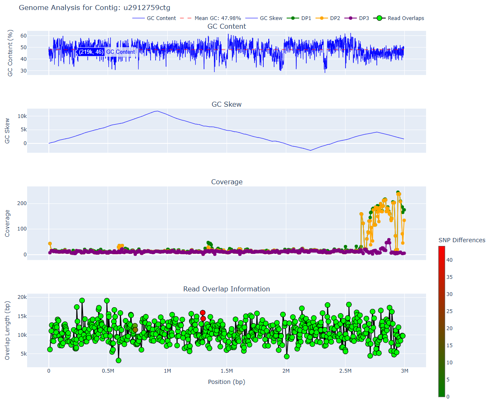
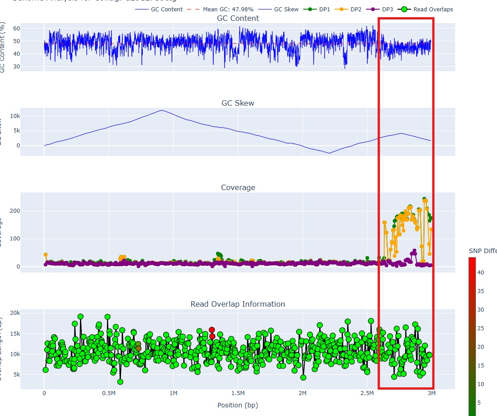

!!! important

    We will be using [mylotools](qc.md#mylotools---scripts-for-myloasm-outputs), a set of scripts for manipulating myloasm's outputs. 

## Using `mylotools plot` to manually inspect long-read overlaps and find chimeras

We provide a plotting utility command called `mylotools plot` to inspect GC content, read overlaps, and coverage information across a contig. Given a contig of interest: e.g. `uXXXXXctg`, simply do

```sh
# you should be in the results directory
cd myloasm_results 

mylotools plot u2912759ctg
ls u2912759ctg_analysis.html
```

### `mylotools plot` output

Open the file `u2912759ctg_analysis.html` in a browser and it will look like:

 

### Panel 1: GC content

- The first panel is the GC content averaged across windows. 
- Prokaryotic genomes should have relatively consistent GC content across the genome. If you see a sharp change in GC content, it may indicate a chimeric breakpoint. 

### Panel 2: Cumulative GC Skew

- See [this article](https://pmc.ncbi.nlm.nih.gov/articles/PMC5538567/) or [this one](https://academic.oup.com/nar/article/26/10/2286/1030593) for more information about GC skew.
- Many prokaryotes have a peak and a trough, indicating origin and terminus of replication. 

### Panel 3: Coverage across the genome

- Each dot is a read that the contig was constructed from.
- There are 3 different read coverage values. [See here](output.md#estimated-depth-of-coverage) for more information about what they mean. DP1 is the most permissive coverage value whereas DP3 indicates exact coverage (perfect alignments). 

### Panel 4: Read overlap information within assembly graph

- Each dot is a read overlap. Statistics about lengths/the read IDs are shown.
- The colour indicates the number of shared/differing SNPs between the reads. An ideal contig involves no differing SNPs between reads, but sometimes this is impossible (e.g. high levels of recombination). 

## Finding chimeric breakpoints from the `plot` graph

The x-axis are *roughly* shared across all of the four plots. The first two panels x-axis are for the polished contig. The bottom two are the raw, unpolished contig. These differ very slightly. 

To find breakpoints, we can look at points on the x-axis where there are unexpected changes.

1. GC content should be *roughly* constant across a prokaryotic genome
2. GC skew often has a single peak and a trough ([see here](https://academic.oup.com/nar/article/26/10/2286/1030593))
3. Coverage should be constant across a contig. However, DP1 (green) and DP2 (yellow) can vary significantly -- inexact repeat regions (across strains or species) can elevate the DP1/DP2 values.
4. Read overlaps should be *long*. Small overlaps can be suspicious. High # of SNP differences are not ideal, but sometimes can not be avoided. 

### Case study: the above graph

The [above graph](#mylotools-plot-output) is for a 99% complete but **18% contaminated** contig from an anaerobic digester metagenome. We see irregularities at around the 2.6 Mbp position.



A few issues occur:

1. The GC content has a noticeable downward shift
2. The cumulative GC skew goes up and down again
3. The DP1/DP2 coverages are *variable and high*, whereas DP1/DP2 before the breakpoint are *consistently low*

This is quite strong evidence for a chimeric join. After removing the bases from 2.6 Mbp onward and rerunning CheckM2, we get a 97% complete and **0% contaminated** contig, confirming our suspicion. 

!!! note

    Around the breakpoint, all overlaps have length > 8kbp and are *almost perfect*. This was probably a recent horizontally transferred region. Even with long reads, metagenomic assembly is still extremely difficult. 