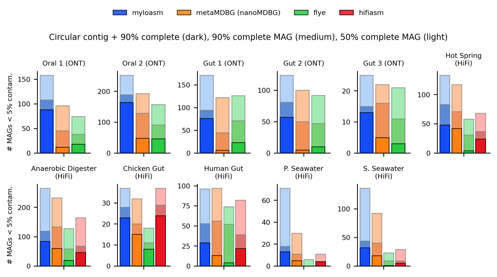

Below are some tentative results that we will show until the preprint comes out. 

<b>Fig. 1</b>. Metagenome-assembled genome (MAG) recovery for Nanopore R10.4 simplex + PacBio HiFi sequencing datasets. Alignment + binning was done with minimap2 and SemiBin2; results are evaulated with CheckM2. 

<b>Fig. 2</b>. Completeness + contamination results from CheckM2 on individual contigs for the different assemblers. Dashed line indicates circular complete MAGs (> 90% complete, < 5% contaminated and circular). 

### Dataset accessions

| Dataset (ONT R10.4)      | Accession   | Dataset (HiFi) | Accession|
|--------------------|-----------|----------------|----------|
| Oral 1  ([Kiguchi et al.](https://www.biorxiv.org/content/10.1101/2024.09.30.615745v1))     | DRR582205 | Hot Spring  ([Kato et al.](https://www.frontiersin.org/journals/microbiology/articles/10.3389/fmicb.2022.1045931/full))    | DRR290133  |
| Oral 2    ([Kiguchi et al.](https://www.biorxiv.org/content/10.1101/2024.09.30.615745v1))           | DRR582179   |Anaerobic Digester ([Benoit et al.](https://www.nature.com/articles/s41587-023-01983-6)) | ERR10905741 |
| Gut 1   ([Minich et al.](http://dx.doi.org/10.2139/ssrn.4960739))          | SRR29980972 |Chicken Gut    ([Zhang et al.](https://academic.oup.com/gigascience/article/doi/10.1093/gigascience/giac116/6833030))    | SRR19683891 |
| Gut 2 ([Minich et al.](http://dx.doi.org/10.2139/ssrn.4960739))            | SRR29980959 |Human Gut ([Gehrig et al.](https://www.microbiologyresearch.org/content/journal/mgen/10.1099/mgen.0.000794))          | SRR15489018 |
| Gut 3    ([Minich et al.](http://dx.doi.org/10.2139/ssrn.4960739))          | SRR29980980 |P. Seawater  ([Priest et al.](https://peerj.com/articles/11721/))      | ERR4920901  |
| | | S. Seawater ([Sidhu et al.](https://microbiomejournal.biomedcentral.com/articles/10.1186/s40168-023-01517-x))       | ERR9769281   |

